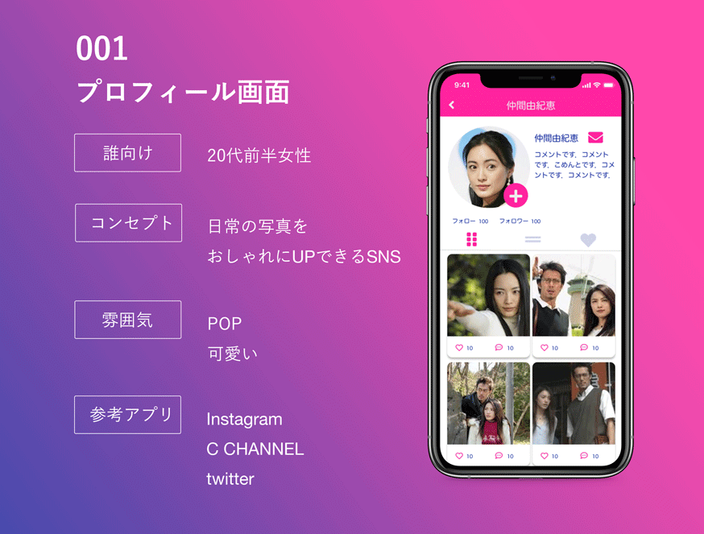

Cocoda!というデザインの学習サイトでの課題です。画像のような条件でFigmaを使って作成しました。 
日常の写真をお洒落に、とのことから日常の写真の雰囲気を壊さぬよう、シンプルな白基調のデザインにしました。 
また、写真のイメージにかかわらずお洒落に見えるように、アプリのデザインにアイコンを多用し、
ビビットなピンクをアクセントカラーに使いました。 
また、いい写真を見つけたらすぐにいいねしたい気持ちになるだろうということで，いいねのアイコンを写真につけました。