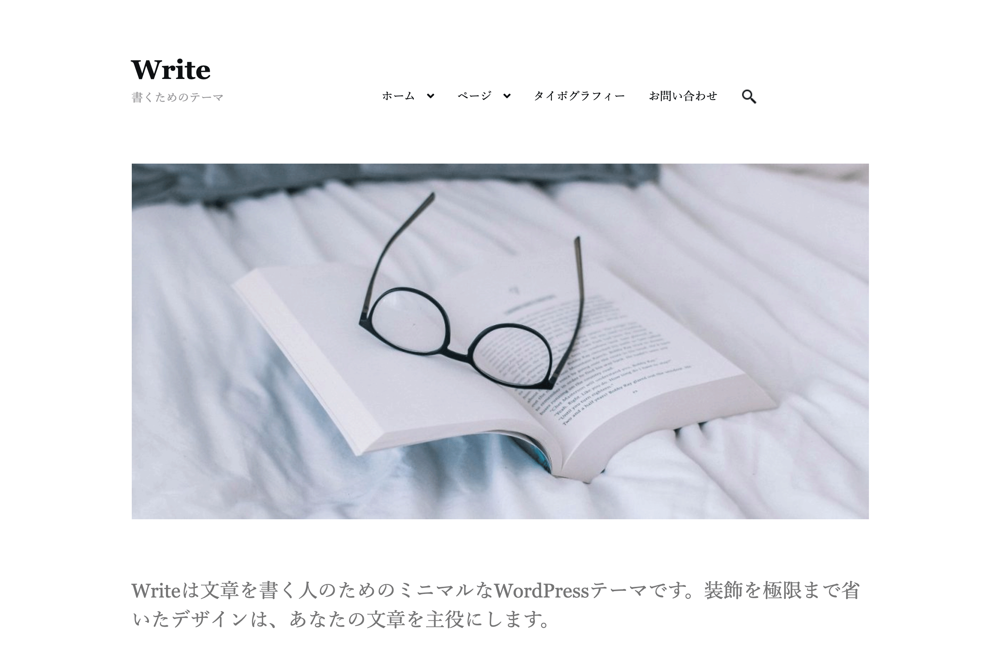
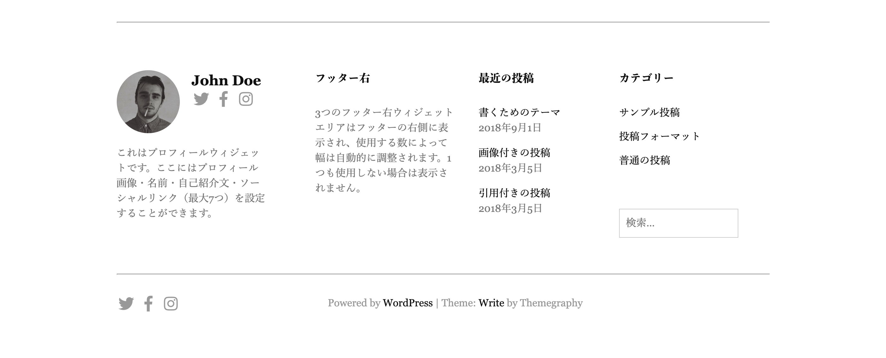

WordPressのテーマ[Write](http://demo.themegraphy.com/write-ja/)を模写コーディングしました。完全には模写しきれていません。ヘッダーの部分ではCSSアニメーションについて理解を深めることができました。

メインの部分では日付の部分を親要素から浮かせることで、ページャー部分を中央に揃えることもできるという気づきを得ることができました。

フッターではflexboxについての理解を深めることができました。
