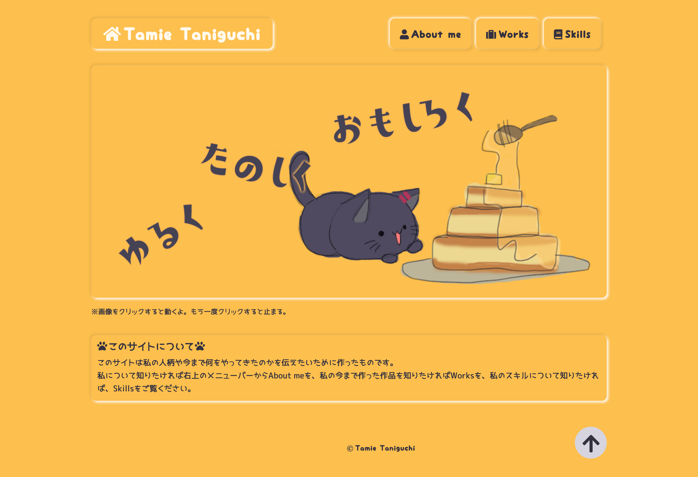

GatsbyJSを使って、コーディングしました。型さえ作れば、マークダウンファイルの追加などだけでメンテナンスが可能なので、とても便利です。
いろいろ分からなくてつまったりしましたが、調べたり、試行錯誤を繰り返し、なんとか作り終えることができて感動しています。 
調べていくうちにGifアニメーションがいきなり動き出すのが、センサティブな人にはよくないということを知りました。そのため動くことをユーザが選択できるようにしました。
また、当初は画面の同じ位置に固定したトップに戻るボタンを作ろうと考えていました。しかし、固定のトップに戻るボタンは押し間違いが多く、ストレスになるという記事を見つけ、ページ下部に置くだけに変更しました。