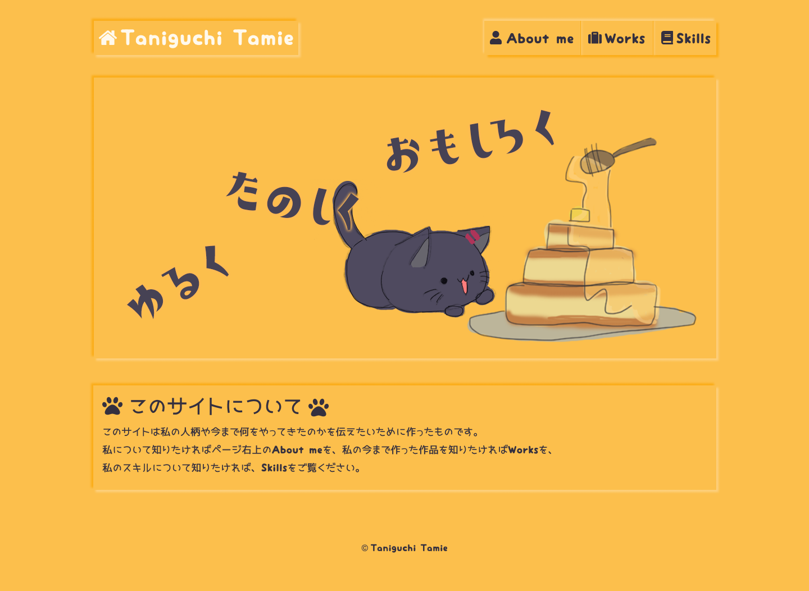
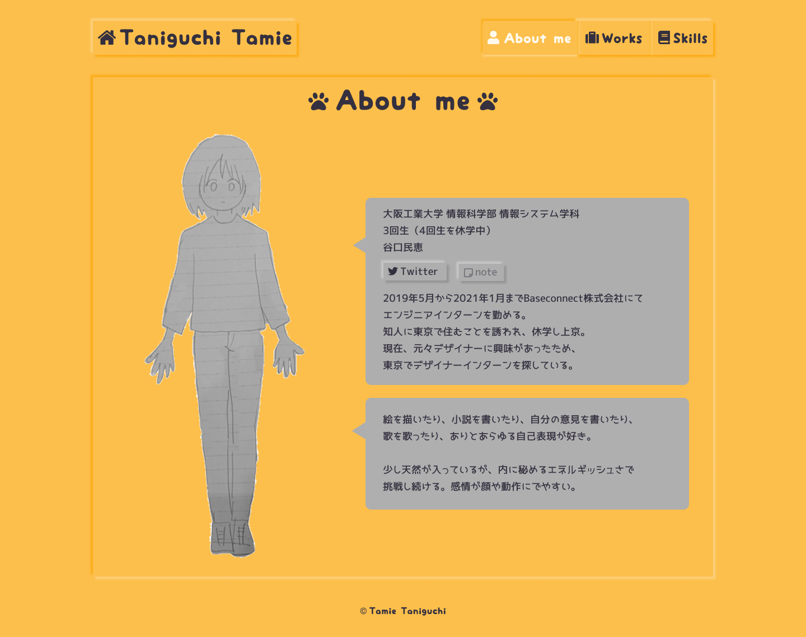
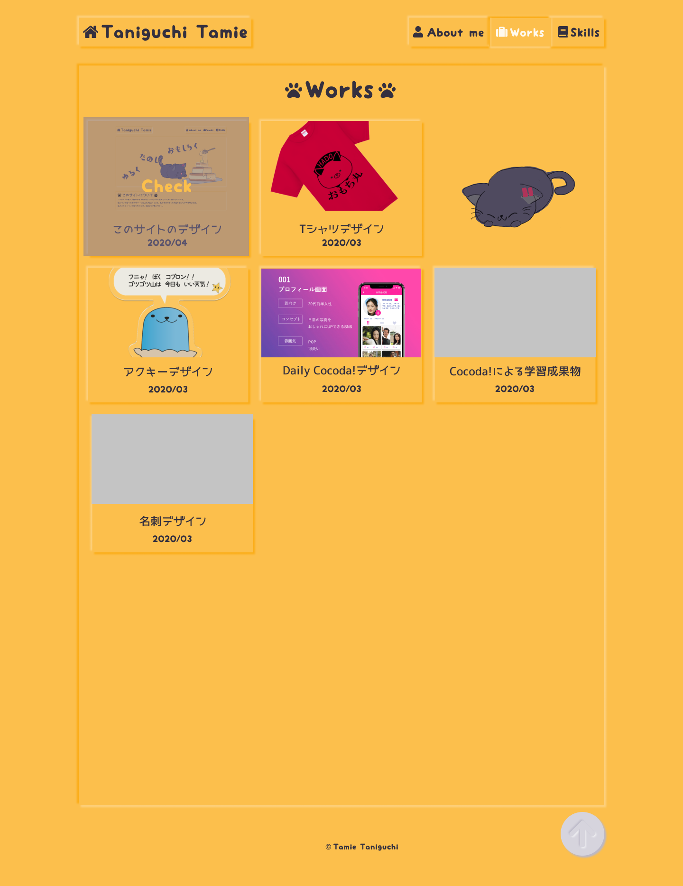
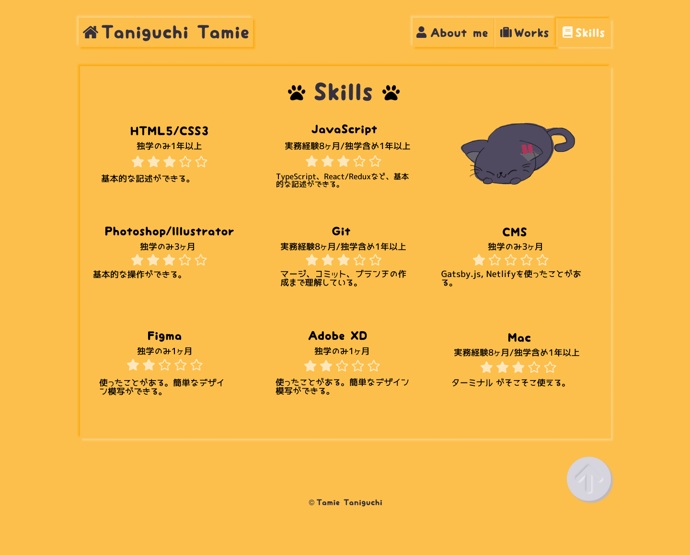
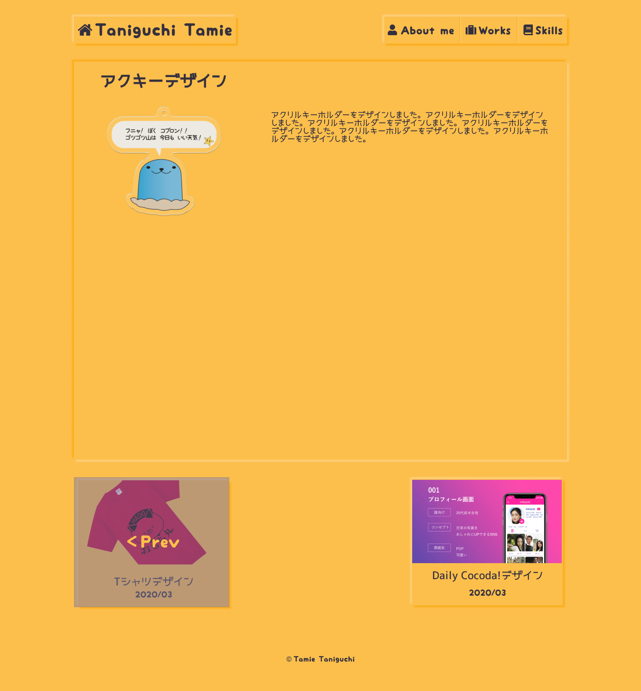

かなり好きにデザインを作ってしまいました。Figmaで作成しました。とにかく全て黄色に作りたかったので、ぴったりなニューモーフィズムがあることに気づき、早速使ってみました。とても可愛く作れて感動しました。 
フォントに特別な物を使用することで、サイト全体に可愛さを付加しました。少し読みにくい部分もありますが、可愛くてワクワクするので私は好きです。
パンケーキや猫など可愛いものが好きなのでヘッダー画像にしてみました。 
また自分がいる位置がどこか判別をつかせるために、自分のいるページのボタンが凹むように考えました。

自分についてのページです。自分をイメージしたイラストを使ってみました。このイラストが手をパタパタさせたり、表情が変わったりするようなページを想像しています。 
吹き出しが灰色なのは、ノートに書いたイラストをそのまま使用してしまったので、その色合いとバランスを取らせようとしたからです。

自分がいままで作ってきた物をまとめたページです。カードレイアウトにして、その1つに動く猫のGifアニメーションをせっかく作ったので、配置してみました。 
ホバー時には画像のように表示されます。 
また、あまり長くなると上に戻るのがめんどくさくなるので、一番下にトップページに戻るボタンを配置しました。

持っているスキルのページです。星の色を他の文字の色と変えることで、少し目立ちやすくしました。

今まで作った物の詳細ページです。詳細な説明を見ることができます。 
わかりやすいように次のページや前のページへいくリンクをWorksページと同じにして、ホバーをすると画像のように表示するように考えました。