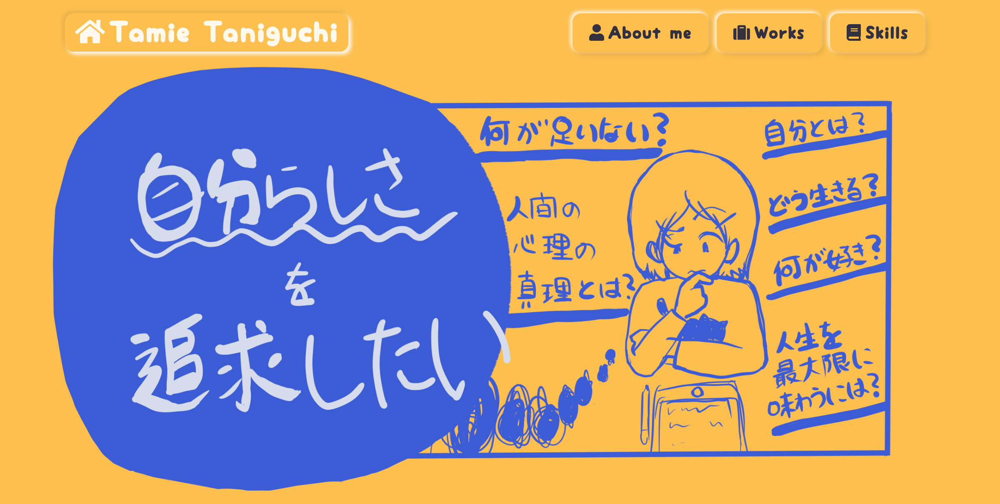
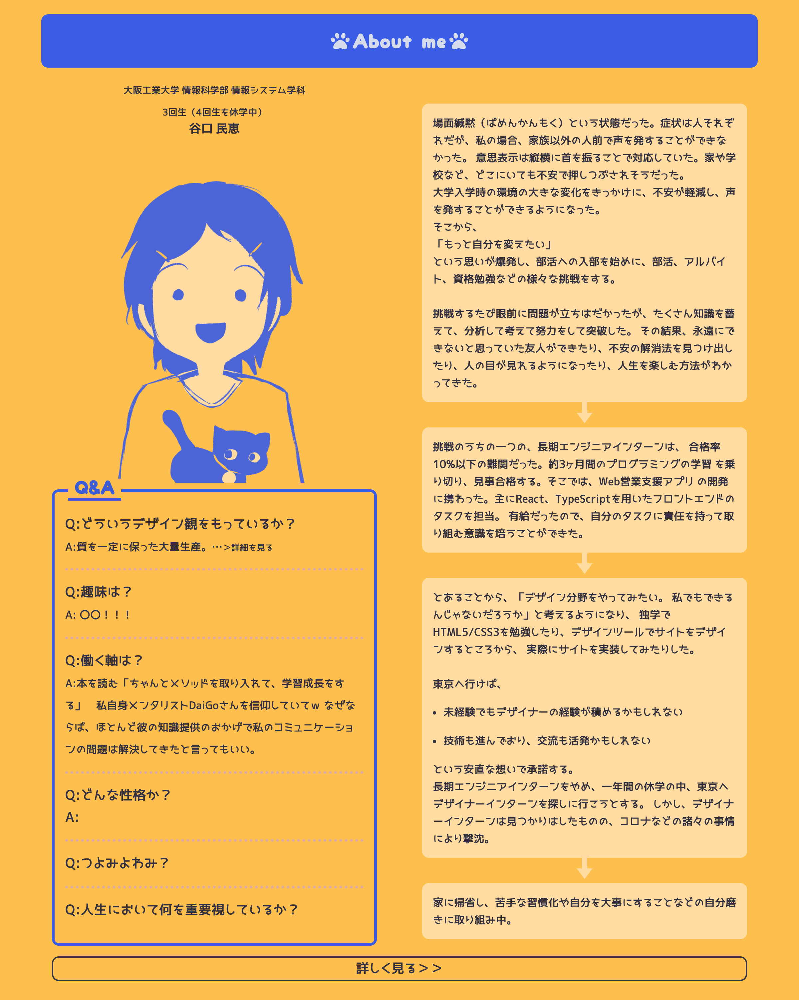

自分を見つめ直したくて、作リ直しました。以前と比べると、取り組むべきタスクを整理しコツコツできたかなという印象です。     
以前のサイトは黄色一色でつまらなかったので、色にあそびをもたせたいなと青を入れてみましたが、なかなかにおしゃれです。以前は使わなかったSCSSを新たに学習し、使ってみました。たのしい。  

これを作っていく上で浮き上がった課題は、時間制限をもうける必要があるということです。私はこだわりが強く、できるまでやり遂げたいと思ってしまいます。    
実際にその問題を解決することが、どれだけの利益を返すのかということを考えず、「気になるから直したい」と思ってとことん時間をかけすぎてしまいます。   
ちゃんと取り組む前に「これに時間をかけることのメリットとは？」「こっちに時間をかけたほうがいいんじゃないか？」を考えて、時間を無駄にしないように、有意義な時間にするように心がけたいです。   
また、自分を見つめ直すために、たくさん文章を書いてまとめてみたのですが、うまくまとまらないし、長くしすぎたなと言う印象です。長いからいいということもないので、シンプルでわかりやすい伝え方を研究すべきだなと思いました。  